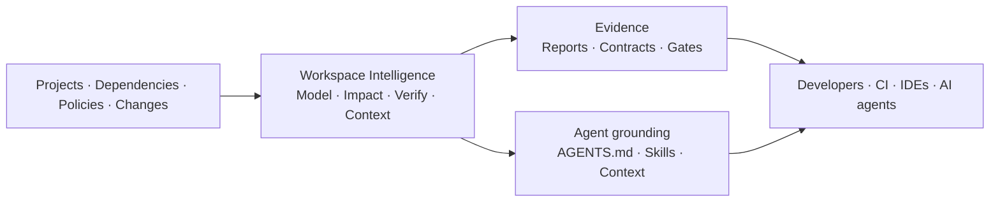

# Workspai Example Workspaces

Real, cloneable examples of
[Workspace Intelligence](https://www.workspai.dev/docs) for software systems.

Start from a raw workspace profile, create a supported project, or bring an
existing project into the architecture through import or in-place adoption.
Languages, frameworks, repositories, and AI tools stay yours; Workspai adds the
shared model, evidence, governance, and agent grounding around them.

Some runnable examples were originally generated with
[RapidKit Core](https://github.com/rapidkitlabs/rapidkit-core) and retain their
legacy metadata as compatibility input. Their current workspace interface and
all new commands use [Workspai](https://github.com/rapidkitlabs/workspai).

Validated runtime baseline: `workspai@0.43.1` and `rapidkit-core==0.5.5`.
Each runnable project carries its own reproducible lockfiles and module
registry; Workspace Intelligence remains the shared architecture across them.

## Why Workspace Intelligence

Workspai is not another AI coding assistant, agent framework, or replacement
for the tools your team already uses.

> One workspace. One truth. Humans and AI aligned.

It adds a shared, evidence-backed intelligence layer around your software
system. Projects, dependencies, policies, changes, health evidence, and release
decisions become one workspace model that developers, CI, IDEs, and AI agents
can use together.

You can keep your existing languages, frameworks, repositories, models, and AI
tools. Workspai generates portable context and grounding surfaces such as
`AGENTS.md`, skills, structured reports, and tool-specific instructions from
the same verified workspace evidence. It complements Claude, Codex, Copilot,
Cursor, and other consumers instead of competing with them.

## Start here

```bash
git clone https://github.com/rapidkitlabs/rapidkit-examples.git
cd rapidkit-examples
npm run hydrate:core -- \
  --workspace quickstart-workspace \
  --project product-api \
  --project ecommerce-api
cd quickstart-workspace

npx workspai workspace sync
npx workspai workspace contract verify --strict --json
npx workspai workspace model --json --write
```

`workspace sync` is idempotent. On a newly cloned machine it registers the
workspace locally, discovers its projects, and refreshes the portable workspace
contract.

`hydrate:core` installs the workspace-pinned Python engine and restores ignored
module runtime payloads from each project's committed `registry.json`.

### Choose a learning path

| You want to... | Continue with... |
| --- | --- |
| Run the smallest complete example | [Quickstart Workspace](quickstart-workspace) |
| Start from an empty language/runtime boundary | [Raw profile fixtures](#raw-profile-fixtures) |
| Add an existing repository without changing its framework | [Import or adopt](WORKSPACE_ONBOARDING.md#add-projects-to-a-workspace) |
| Understand changes, impact, and verification | [Workspace Intelligence chain](WORKSPACE_ONBOARDING.md#run-the-workspace-intelligence-chain) |
| Ground Claude, Codex, Copilot, Cursor, or another agent | [Agent and IDE files](WORKSPACE_ONBOARDING.md#generate-files-for-ai-agents-and-ides) |
| Add strict release checks | [CI and release](WORKSPACE_ONBOARDING.md#before-ci-or-release) |

## Published workspaces

| Workspace | Projects | Focus | Level |
| --- | ---: | --- | --- |
| [Quickstart](quickstart-workspace) | 2 | FastAPI, auth, PostgreSQL, Redis, observability | Beginner |
| [AI Agent](my-ai-workspace) | 2 | FastAPI and NestJS agent implementations | Intermediate |
| [SaaS Starter](saas-starter-workspace) | 4 | Multi-service SaaS APIs, admin, webhooks | Advanced |

Machine-readable catalog: [examples.json](examples.json).

Publication rules: [PUBLICATION_CONTRACT.md](PUBLICATION_CONTRACT.md).

Complete clone, registry, import, adopt, and Workspace Intelligence workflow:
[WORKSPACE_ONBOARDING.md](WORKSPACE_ONBOARDING.md).

## Raw profile fixtures

Every supported profile is published as an empty, CLI-generated workspace at
the repository root so its foundation is visible and directly cloneable:

| Profile | Raw workspace |
| --- | --- |
| `minimal` | [minimal-workspace](minimal-workspace) |
| `java-only` | [java-only-workspace](java-only-workspace) |
| `python-only` | [python-only-workspace](python-only-workspace) |
| `node-only` | [node-only-workspace](node-only-workspace) |
| `go-only` | [go-only-workspace](go-only-workspace) |
| `dotnet-only` | [dotnet-only-workspace](dotnet-only-workspace) |
| `polyglot` | [polyglot-workspace](polyglot-workspace) |
| `enterprise` | [enterprise-workspace](enterprise-workspace) |

They demonstrate profile and foundation contracts only. Application projects
are intentionally kept in the real examples above, while the complete kit
matrix is verified by CLI generator tests.

Profile boundaries and publication rules: [PROFILE_WORKSPACES.md](PROFILE_WORKSPACES.md).

## Workspace Intelligence



Each published workspace includes:

- `.workspai-workspace` as the canonical workspace marker
- `.workspai/workspace.json` for workspace identity and profile
- `.workspai/workspace.contract.json` as the portable project contract
- `.workspai/policies.yml` and `.workspai/toolchain.lock` for governance
- legacy `.rapidkit*` metadata required by the original Core-backed projects

The legacy files are compatibility inputs, not the current public interface.
Do not delete them until the example projects are regenerated by a compatible
Workspai-owned kit. Machine-local reports, registry summaries, and absolute
adoption records are intentionally ignored and regenerated after cloning.

## Run an example

### Quickstart

```bash
cd quickstart-workspace/product-api
cp .env.example .env
npx workspai init
npx workspai dev
```

### AI Agent

```bash
cd my-ai-workspace/ai-agent
cp .env.example .env
npx workspai init
npx workspai dev
```

NestJS variant:

```bash
cd my-ai-workspace/ai-agent-nest
cp .env.example .env
npx workspai init
npx workspai dev -p 8013
```

### SaaS Starter

```bash
cd saas-starter-workspace
npx workspai doctor workspace
npx workspai workspace run init
```

See each workspace README for service ports, infrastructure, endpoints, and
module-specific setup.

## Pro showcases

[pro-showcase](pro-showcase) contains public product descriptions only. Paid
source code, customer archives, entitlement logic, and release evidence remain
private. Showcase directories are not presented as runnable workspaces.

## Publication policy

- Free examples must remain cloneable and useful without private dependencies.
- Published commands must use the current `workspai` npm CLI.
- Portable contracts may be committed; machine-local evidence may not.
- Pro availability claims require a real release candidate or published product.
- `examples.json`, workspace contracts, and directory contents must agree.

Run the repository integrity check before publishing:

```bash
corepack npm run check
```

## Ecosystem

| Surface | Link |
| --- | --- |
| RapidKit Labs | [getrapidkit.com](https://getrapidkit.com) |
| Workspai product | [workspai.com](https://workspai.com) |
| Knowledge portal | [workspai.dev](https://workspai.dev) |
| Workspai CLI | [rapidkitlabs/workspai](https://github.com/rapidkitlabs/workspai) |
| VS Code extension | [rapidkitlabs/rapidkit-vscode](https://github.com/rapidkitlabs/rapidkit-vscode) |
| RapidKit Core | [rapidkitlabs/rapidkit-core](https://github.com/rapidkitlabs/rapidkit-core) |
